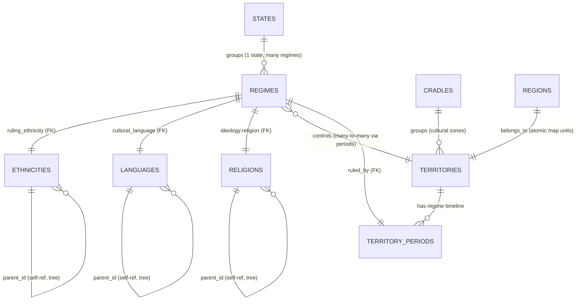

# CivRegime Database Schema (ERD)

## Entity-Relationship Diagram



---

## Table Definitions (CSV Format)

### **1. STATES** (political continuities)
```csv
id | name | description
roman_state | Roman State | Political continuity from Augustus to 1453
ottoman_state | Ottoman State | Political continuity from Osman I to Mehmed VI
```

**CSV Fields:**
- `id` (PK): unique state identifier
- `name`: display name
- `description`: optional history/notes

---

### **2. REGIMES** (eras within states)
```csv
id | name | state_id | id_ruling_ethnicity | id_ruling_language | id_ruling_religion | start | end
roman_pagan | Roman Empire (Pagan) | roman_state | latin | latin | roman_paganism | -27 | 380
roman_christian | Roman Empire (Christian) | roman_state | latin | latin | catholic | 380 | 476
byzantine | Byzantine Empire | roman_state | hellenic | medieval_greek | eastern_orthodox | 395 | 1453
ottoman_early | Ottoman Empire (Early) | ottoman_state | turkish | ottoman_turkish | islam | 1299 | 1400
```

**CSV Fields:**
- `id` (PK): unique regime identifier
- `name`: display name (how users see it)
- `state_id` (FK): → STATES.id (optional, invisible to user)
- `id_ruling_ethnicity` (FK): → ETHNICITIES.id
- `id_ruling_language` (FK): → LANGUAGES.id
- `id_ruling_religion` (FK): → RELIGIONS.id
- `start`: year (negative = BCE)
- `end`: year or NULL (ongoing)

---

### **3. TERRITORIES** (primary)
```csv
id | name | regime_count | regimes_json
egypt | Egypt | 17 | [{"regime_id":"old_kingdom_egypt","start":-2686,"end":-2181}, ...]
italy | Italy | 8 | [...]
```

**CSV Fields:**
- `id` (PK): territory identifier
- `name`: display name
- `regime_count`: count of regimes that controlled it
- `regimes_json` (array): chronological list of regime periods (can be stored as separate TERRITORY_PERIODS table)

**Better normalized structure:**
- Separate `TERRITORY_PERIODS` table:
  - `territory_id` (FK) | `regime_id` (FK) | `start` | `end`

---

### **4. ETHNICITIES** (taxonomy tree)
```csv
id | name | parent | description | founded | status
macedonian | Macedonian | latin | ... | -500 | active
greek | Greek | latin | ... | -800 | historical
```

**CSV Fields:**
- `id` (PK): ethnicity identifier
- `name`: display name
- `parent` (FK, self-referential): → ETHNICITIES.id (NULL for roots)
- `description`: text
- `founded`: year or NULL
- `status`: active | historical | deprecated

---

### **5. LANGUAGES** (taxonomy tree)
```csv
id | name | parent | description | founded
ancient_greek | Ancient Greek | greek | ... | -800
koine_greek | Koine Greek | greek | ... | -300
```

**Structure identical to ETHNICITIES**

---

### **6. RELIGIONS** (taxonomy tree)
```csv
id | name | parent | description | founded | schema_type
abrahamic | Abrahamic | (null) | ... | -2000 | root
christianity | Christianity | abrahamic | ... | 0 | branch
roman_catholicism | Roman Catholicism | christianity | ... | 1054 | leaf
```

**Structure identical to ETHNICITIES**

---

### **7. IDEOLOGIES** (lookup table - flat)
```csv
religion | government | name | description
roman_paganism | imperial_monarchy | Imperial Pagan Rome | ...
catholic | democracy | Catholic Democracy | ...
```

**CSV Fields:**
- `religion` (FK): → RELIGIONS.id
- `government`: government type (string)
- Composite PK: (religion, government)

---

### **8. CRADLES** (broad cultural zones)
```csv
id | name | description | territories
mediterranean | Mediterranean Cradle | ... | italy;greece;etc
```

**CSV Fields:**
- `id` (PK)
- `name`
- `description`
- `territories`: semicolon-delimited FK array → TERRITORIES.id

---

### **9. REGIONS** (atomic map units - GeoJSON features)
```csv
id | territory | name | geojson_geometry
reg_egypt_001 | egypt | Upper Nile | {...}
```

**CSV Fields:**
- `id` (PK)
- `territory` (FK): → TERRITORIES.id
- `name`: region display name
- `geojson_geometry`: GeoJSON feature (can be stored separately)

---

### **Optional: TERRITORY_PERIODS** (denormalization of TERRITORIES.regimes)
```csv
territory_id | regime_id | start | end | regime_name
egypt | old_kingdom_egypt | -2686 | -2181 | Old Kingdom Egypt
egypt | new_kingdom_egypt | -1550 | -1070 | New Kingdom Egypt
```

**Purpose:** Easier to query "which regimes ruled territory X during period Y"

---

## Key Relationships

| From | To | Type | Cardinality | Notes |
|------|-----|------|-----|-------|
| REGIMES | STATES | state_id | N:1 | Many regimes belong to one state (invisible to user) |
| REGIMES | ETHNICITIES | ruling_ethnicity | N:1 | Many regimes can share one ethnicity |
| REGIMES | LANGUAGES | cultural_language | N:1 | Many regimes can share language |
| REGIMES | RELIGIONS | ideology.religion | N:1 | Through IDEOLOGIES |
| REGIMES | TERRITORIES | territories | N:M | Many-to-many via array or junction table |
| TERRITORIES | REGIMES | controlled_by | N:M | Inverse relationship |
| ETHNICITIES | ETHNICITIES | parent | N:1 | Tree structure (self-ref) |
| LANGUAGES | LANGUAGES | parent | N:1 | Tree structure (self-ref) |
| RELIGIONS | RELIGIONS | parent | N:1 | Tree structure (self-ref) |

---

## CSV → JSON Generation Pipeline

The system uses **CSV as the single source of truth** for all historical data. A Node.js pipeline automatically converts CSVs to JSON files that power the frontend visualizations.

### Workflow
1. **Edit CSV files** in `csvs/` directory (using any spreadsheet editor or text editor)
2. **Run generation scripts** in `code/csv2json/` to regenerate JSON output
3. **JSON files** in `data/` are automatically updated
4. **Frontend** loads updated JSON and visualizations refresh

### CSV Files (Data Source)

| File | Rows | Purpose | Primary Key |
|------|------|---------|-------------|
| `csvs/states.csv` | 2+ | Political continuities (grouping regimes) | `id` (numeric or text) |
| `csvs/regimes.csv` | 138 | Historical eras/regimes with their ruling culture | `id` |
| `csvs/territories.csv` | 39 | Geographic regions controlled by regimes | `id` |
| `csvs/territory_periods.csv` | 301 | Junction table: which regime controlled which territory during which period | `territory_id`, `regime_id` |
| `csvs/ethnicities.csv` | 263 | Ethnic/cultural groups (hierarchical tree) | `id` (numeric) |
| `csvs/languages.csv` | 62 | Languages and language families (hierarchical tree) | `id` (numeric) |
| `csvs/religions.csv` | 261 | Religions and denominations (hierarchical tree) | `id` (numeric) |

### Generation Scripts

**`code/csv2json/states.js`**
- Input: `csvs/states.csv`
- Output: `data/states.json` (single file with all states)
- Run: `node code/csv2json/states.js`

**`code/csv2json/regimes.js`**
- Input: `csvs/regimes.csv`
- Output: `data/regimes/*.json` (one file per regime)
- Features:
  - Converts numeric foreign keys to regime IDs
  - Includes state grouping information
  - Generates 138 regime files
- Run: `node code/csv2json/regimes.js`

**`code/csv2json/territories.js`**
- Input: `csvs/territories.csv` + `csvs/territory_periods.csv`
- Output: `data/territories/*.json` (one file per territory)
- Features:
  - Merges regime control periods into each territory
  - Embeds complete timeline of which regimes controlled the territory
  - Generates 39 territory files
- Run: `node code/csv2json/territories.js`

### Data Flow Example

**CSV Input** (`csvs/regimes.csv`):
```csv
id,name,state_id,id_ruling_ethnicity,id_ruling_language,id_ruling_religion,start,end
1,Roman Empire (Pagan),1,5,335,106,-27,380
```

**Generated JSON Output** (`data/regimes/1.json`):
```json
{
  "id": "1",
  "name": "Roman Empire (Pagan)",
  "state_id": 1,
  "ruling_ethnicity": 5,
  "ruling_language": 335,
  "ruling_religion": 106,
  "start": -27,
  "end": 380
}
```

### Key Design Decisions

1. **Numeric IDs in CSV**: Tree structures (ethnicities, languages, religions) use numeric IDs (1, 2, 3...) to avoid naming inconsistencies when referenced from different data sources. The `old_id` column preserves original semantic IDs for reference.

2. **Foreign Key References**: All FK relationships in CSV use numeric IDs, which are maintained during JSON generation for consistency.

3. **Territory Timeline**: Instead of embedding regimes directly in territories.csv, we use a junction table (`territory_periods.csv`) to normalize the many-to-many relationship, then merge it back into JSON for frontend simplicity.

4. **State Grouping**: STATES group related REGIMES (e.g., "Roman State" contains "Roman Empire (Pagan)" and "Roman Empire (Christian)"). This is invisible to frontend but useful for organizing historical data.

---

## Implementation Notes

### Storage Format (CSV → SQLite/DuckDB)
1. **Flat entities** (REGIMES, TERRITORIES, IDEOLOGIES): One CSV per table
2. **Trees** (ETHNICITIES, LANGUAGES, RELIGIONS): One CSV per tree, with parent column
3. **Arrays** (TERRITORIES.regimes, REGIMES.territories): 
   - Option A: Store as JSON string in CSV, parse in app
   - Option B: Create junction tables for normalized design
4. **Nested objects** (REGIMES.ideology, REGIMES.figures, REGIMES.policies):
   - Store as JSON in the CSV, or break into separate tables for strict normalization

### Suggested Primary Key Strategy
- All PKs are natural keys (meaningful IDs like `macedonian_empire`, `egypt`, `roman_paganism`)
- No surrogate integer PKs needed unless you need physical record IDs

### Indexing Strategy (for SQLite/DuckDB later)
- Index on: `(regime_id, start, end)` for territory timeline queries
- Index on: `parent` for tree traversal
- Index on: `ruling_ethnicity`, `cultural_language` for filtering

---

## CSV vs. Current JSON Structure

| Aspect | Current (JSON files) | Proposed (CSV) |
|--------|-------------------|------------------|
| Hierarchy | Directory structure | `parent` column |
| Querying | App-side loading + filter | SQL queries |
| Relationships | Embedded/denormalized | Foreign keys explicit |
| Scalability | Files in RAM | Deferred to DB layer |
| Human-readable | Yes (JSON) | Yes (CSV) |
| Version control | Good (one file per entity) | Good (one CSV per table) |

---
