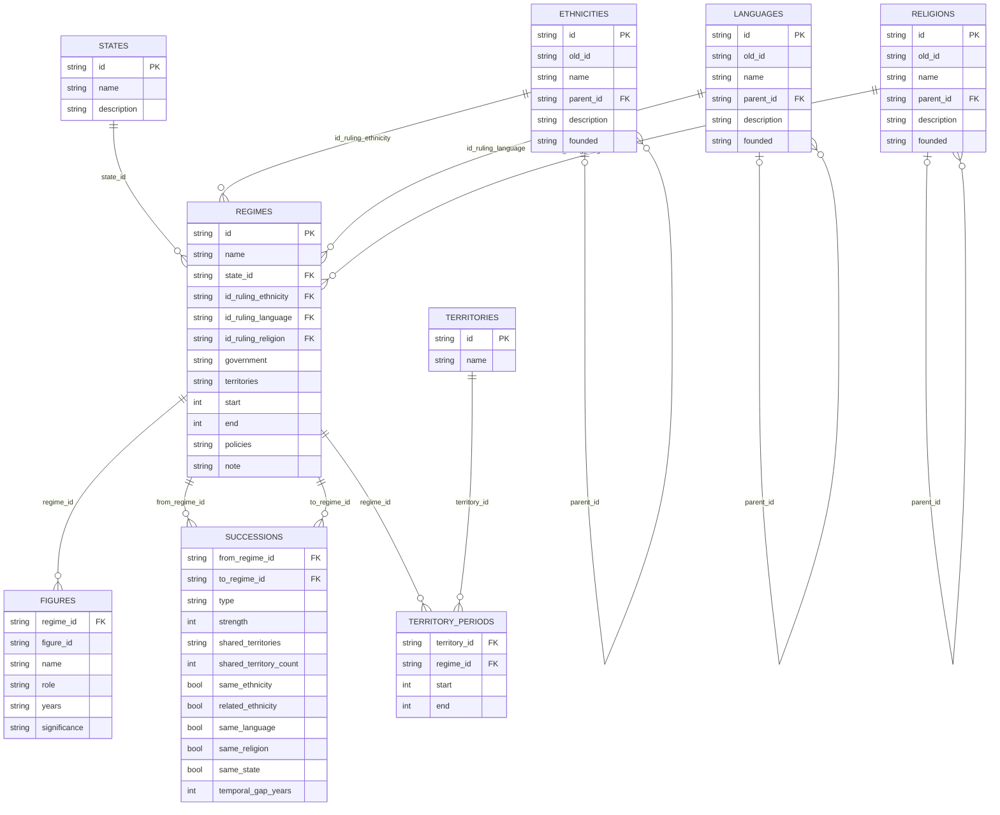

# CivRegime Entity-Relationship Diagram

## Notes

- `SUCCESSIONS` has a composite PK: `(from_regime_id, to_regime_id)`
- `FIGURES` has a composite PK: `(regime_id, figure_id)`
- `TERRITORY_PERIODS` has a composite PK: `(territory_id, regime_id)`
- `territories` and `policies` in REGIMES are pipe-separated denormalized references — normalized form is `TERRITORY_PERIODS`
- Tree tables (ETHNICITIES, LANGUAGES, RELIGIONS) are self-referential via `parent_id`
